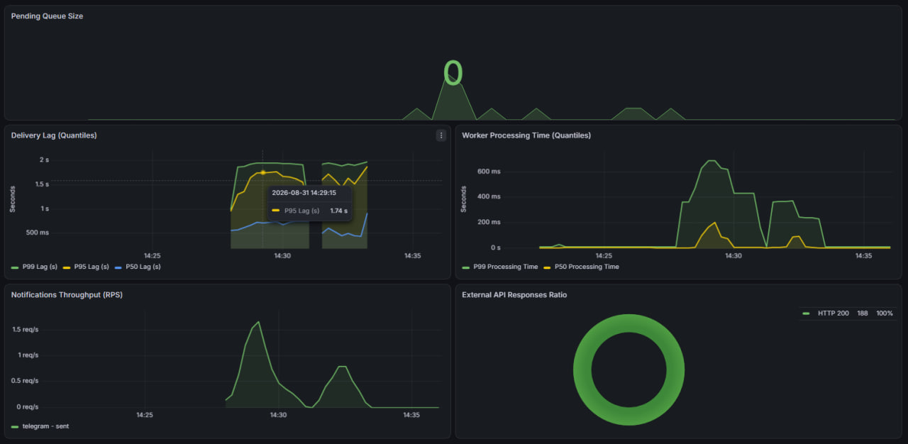

## v 1.0
## 🛠 Архитектурные решения

* **FastAPI (Async):** Выбран для построения API из-за высокой производительности при обработке асинхронных сетевых операций и встроенной валидации входных данных через Pydantic.
* **PostgreSQL:** Используется в качестве основного хранилища данных. Обеспечивает строгую надежность, гарантируя сохранность статусов и базы уведомлений при любых сбоях системы.
* **aiogram 3.0:** Содержит полную асинхронную поддержку Telegram Bot API на базе `asyncio` и `aiohttp`. Позволяет обрабатывать входящие события и выполнять рассылки без блокировки основного потока выполнения.

---

## 📊 Метрики мониторинга (Observability)

Система мониторинга построена на базе Prometheus и Grafana с акцентом на анализ производительности очереди и взаимодействий с внешними API:

* **Notifications Pending Count - текущее количество просроченных уведомлений в очереди PENDING:** 
  Отображает текущее количество накопившихся уведомлений в статусе `PENDING`, ожидающих отправки. Отслеживает динамические колебания в реальном времени (значение может как расти, так и уменьшаться). Непрерывный рост показателя сигнализирует о падении воркеров или образовании затора в очереди.
* **Delivery Lag (процентили P50, P95, P99) - отклонение фактического времени отправки от запланированного (в миллисекундах):** 
  Показывает разницу между запланированным временем отправки и фактической доставкой. Позволяет выявлять отставание очереди.
* **Worker Processing Time (процентили P50, P99) - время выполнения циклов воркерами:** 
  Показывает распределение длительности циклов работы воркера за временное окно. **P50** отражает максимальное время, в которое укладываются 50% самых быстрых циклов (медиана), а **P99** — время, за которое успевают выполниться 99% всех циклов.
* **Notifications Throughput (RPS):** 
  Отображает текущую пропускную способность системы — количество успешно отправленных уведомлений в секунду. Остановке этого показателя и одновременный рост показателей нагруженности системы (первые три) сигнализируют нехватку мощностей сервиса для отправки большего кол-ва уведомлений.
* **External API Responses (Status Codes Ratio):** 
  Следит за ответами сторонних сервисов (Telegram API). Позволяет вовремя фиксировать превышение лимитов (HTTP 429 Rate Limits) или сетевые ошибки (HTTP 5xx).

## v 1.1

## 🛠 Архитектурные решения

* **Микросервисная изоляция:** Проект разделен на отдельные сервисы (`services/api`, `services/worker`, `services/bot`) со своими `main.py`, зависимостями и независимыми Docker-сборками, а общие сущности вынесены в `common`.
* **Доменно-ориентированная структура:** Кодовая база реорганизована по доменному принципу (например, `user/`, `notification/`, `channel/`), где внутри каждого домена выделены слои `models`, `service`, `schema` и `repository`.
* **Слоистая архитектура (Clean Architecture):** Введено строгое разделение логики: бизнес-правила (в сервисах) изолированы от прямого взаимодействия с ORM/БД (в репозиториях). Контроллеры занимаются только валидацией входа и передачей данных в сервис.
* **Расширяемая система каналов доставки:** Модель данных обновлена для поддержки множества каналов у пользователя через сущность `DeliveryChannel`.
* **Отказоустойчивость воркеров:** Добавлен механизм ограниченных повторных попыток (ретраев) с экспоненциальной задержкой для обработки транзиентных ошибок доставки (сетевые сбои, HTTP 429) перед окончательным переводом задачи в статус `FAILED`.

---

## 📊 Метрики мониторинга и логирование (Observability)

* **Эффективность воркера (Worker Success Rate):** 
  Внедрен счетчик `worker_succeeded_to_total` для отслеживания количества принятых и успешно завершенных задач. Этот показатель позволяет видеть долю потерянных задач.
* **Контекстное логирование:** 
  Логирование стандартизировано с использованием `contextvars.ContextVar` и менеджера контекста. Теперь метаданные (такие как `service`, `user_id`, `notification_id`) подмешиваются в каждую запись лога автоматически, устраняя дублирование блоков `extra`.

